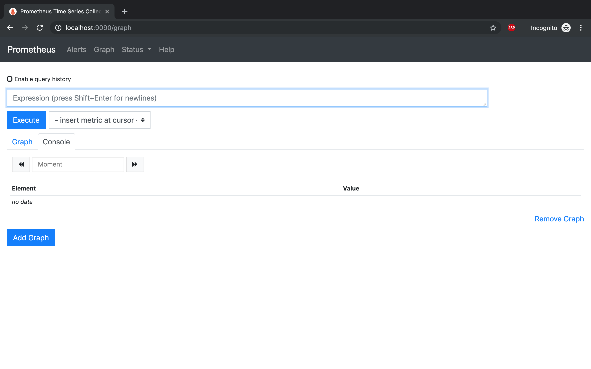
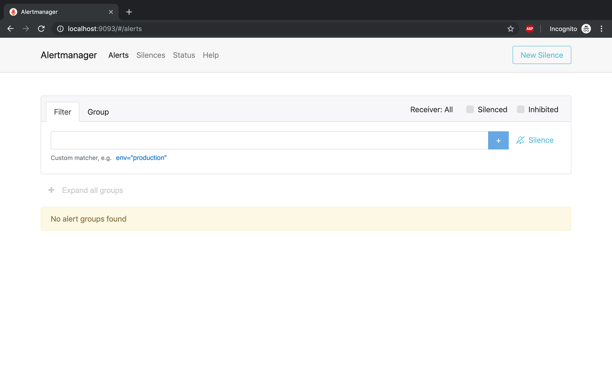
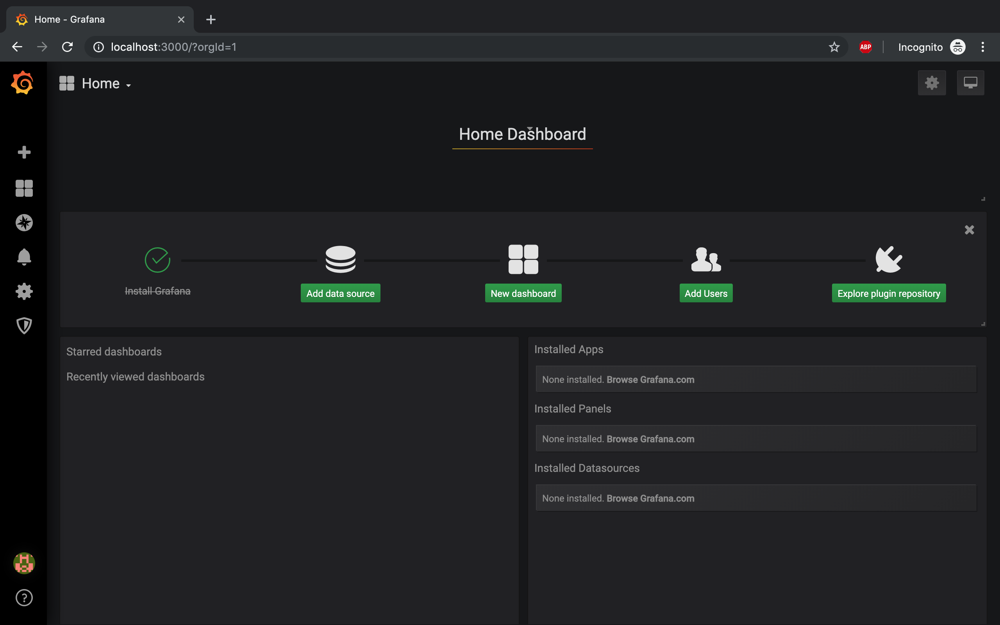
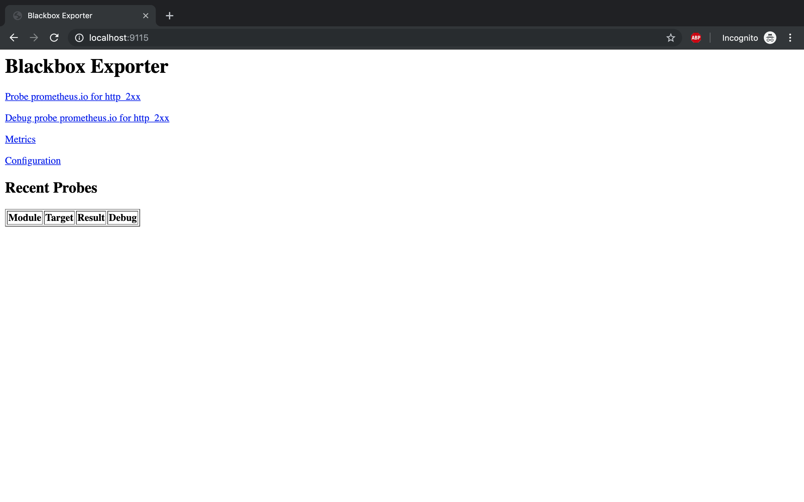

# Workshop Prometheus ♥️ Grafana

## Ứng dụng

- Prometheus
- Grafana
- Alertmanager
- blackbox_exporter
- Slack

## Yêu cầu

- Hệ điều hành: *nix
- Docker 17.x or 18.x
- docker-compose

## Chuẩn bị

- Clone Repo: `https://github.com/vietdien2005/workshop-prometheus.git`
- Chạy môi trường lệnh: `docker-compose up -d`
- Truy cập Prometheus [http://localhost:9090](http://localhost:9090)

- Truy cập Alertmanager [http://localhost:9093](http://localhost:9093)

- Truy cập Grafana [http://localhost:3000](http://localhost:3000) và login với `username/password: admin / admin`

- Truy cập Blackbox Exporter [http://localhost:9115](http://localhost:9115)

- Các bạn dựng sẵn những ứng dụng trên để chuẩn bị cho workshop, mình sẽ hướng dẫn cấu hình thêm rules, alert, dashboard, ... trong buổi workshop ngày **23/08/2019**

## Hẹn gặp các bạn ngày 23/08/2019 ở Sihub nhé
